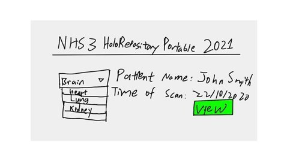
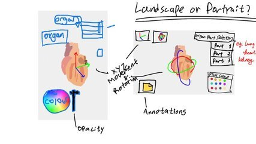

# 2/10/2020-18/10/2020

This week we were assigned our projects and teams. Our brief is as follows: 

**HoloRepository Portable 2021  (UCL/GOSH/Intel) will be an open source mobile 3D renderer and modelling app, with GLB file viewer, some graphics layering and DICOM annotations layers. It will be built in Unity for mobiles and tablets (and some special devices/glasses). There is also opportunity to have it work with HoloLens 2 and VR headsets if we are allowed to use the equipment in term 2. Health Education England will also preview the requirements and the progression of work if they are available.** 

As a team, our first order of business was to introduce ourselves to one another and then schedule a time to meet with our clients in order to introduce ourselves and gain a deeper understanding of what our project will look like. In the meeting our clients introduced us to a number of different technologies that we will have to explore, the most important of which being:

Unity: A cross platform game engine. 
Holopipelines: A cloud-based service that performs the automatic generation of 3D models from 2D image stacks, ie the generation of 3D models of organs from DICOM image stacks. 
GLTF (Graphics Language Transmission Format) – an open source, standard file format for 3D scenes and models. GLTF files have two file extensions, .gltf (which can reference external binary and texture resources) and .glb (which are entirely self contained). 
FHIR (Fast Healthcare Interoperability Resources) -a protocol that handles the exchange of electronic health records. 
The last two technologies also require an understanding of JSON which we will also need to learn. 
As part of our HCI (Human Computer Interaction) coursework we have to create an interactive prototype of our project. We started off this week by creating a few low fidelity sketches, and then carried out a number of semi-structured interviews on pseudo-users (other members of our course). Showing our pseudo-users our designs proved to be very helpful, as it made the questions we asked seem less abstract and enabled them to give us a more concrete idea of what users would want from an app like this. 

