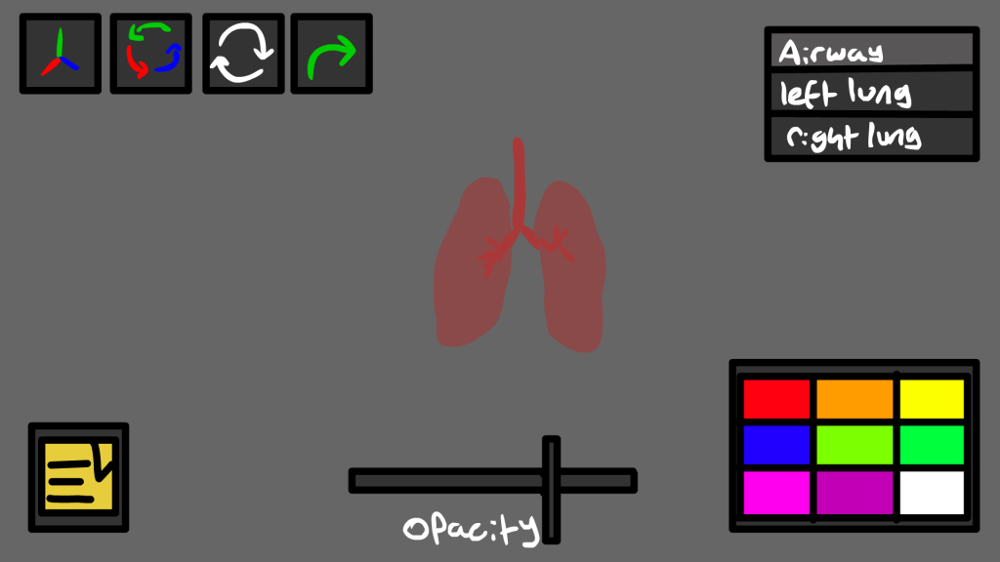
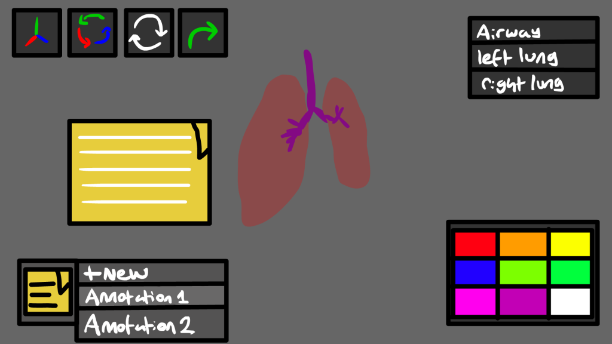
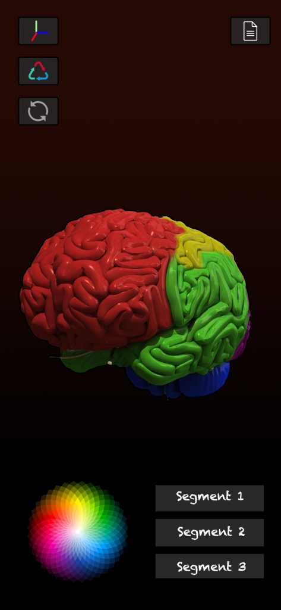
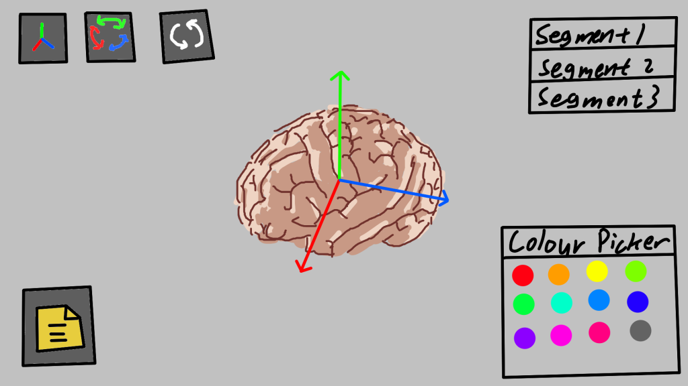

# 19/10/2020 – 25/10/2020 - UI Sketching

After we thought about what our software can do, we started to design the User Interface (UI). 
In this week, we sketched the basic look of the UI. 
We first decided that the app should be used horizontally, so that the 3D models can be displayed in a greater space. 
Secondly, we discussed the functions that this app can achieve and arranged these function icons on the interface clearly. 
We also had some discussion about background colour, but we had no conclusion yet. We were quite optimistic about this sketch. 

