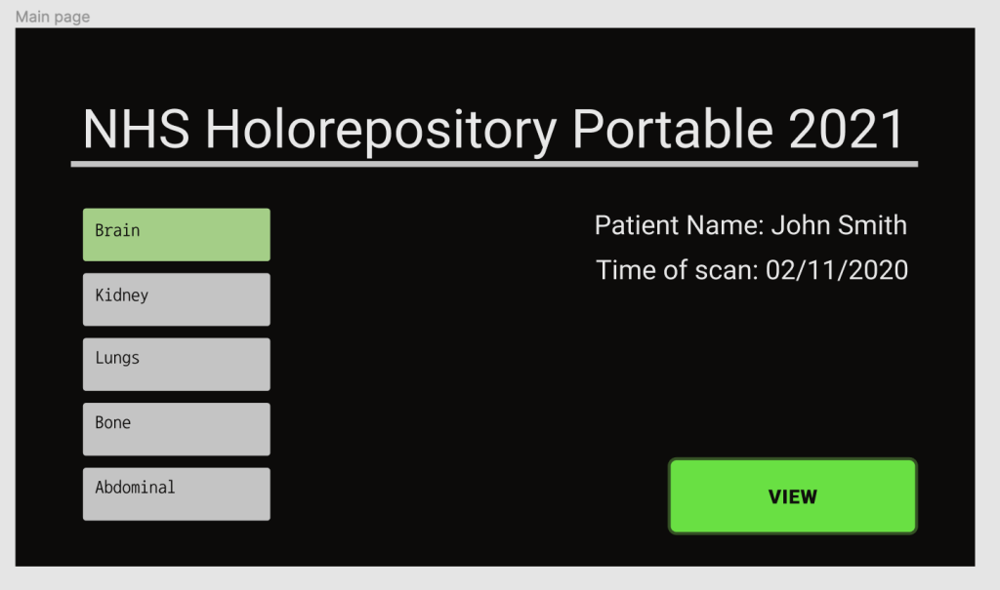
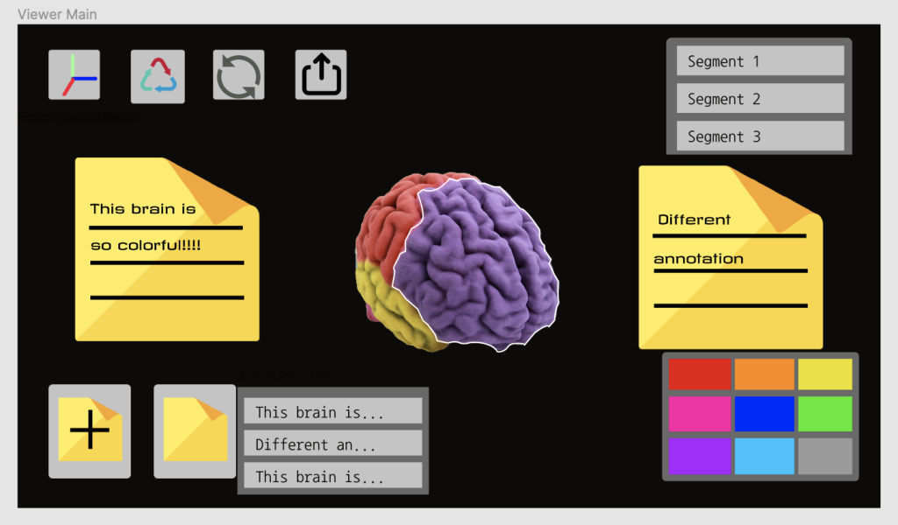

# 26/10/2020 – 01/11/2020 - First Prototype

This week we built the first prototype of our app using Figma which is a very popular website for developers to design UI. 
[You can view it here](https://www.figma.com/proto/quo6iAuwTDs2te9PNm6VeN/Holorepository-prototype-1?node-id=3%3A22&scaling=scale-down)  
 
*Figure 1: The main page*  
As shown in Figure 1, our main page is very simple. 
In this interface, users can directly select the organ models they want to view, such as brain,kidney, lung and so on. 
After selecting the organ, users can view and edit the 3D model by clicking the “view” button in the lower right corner.   
 
*Figure 2: The main page*  
Figure 2 shows the model editing interface. There are four buttons in the upper left corner of the image. 
The first button allows the user to move the model by dragging and dropping, the second button makes the model rotate,  
the third button removes all unsaved operations, namely restore the model, and the fourth button represents “exit”. 
Users can slide through the selector in the upper right corner and select the area they want to edit, and they can change  
its color (the palette in the lower right corner) and transparency (not shown in this image). In addition, users can also add 
comments to the model to record symptoms, diagnosis and other information.
