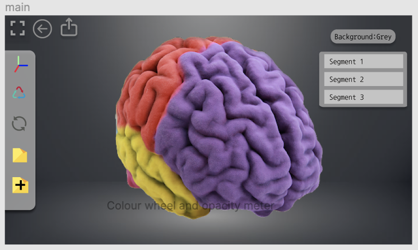
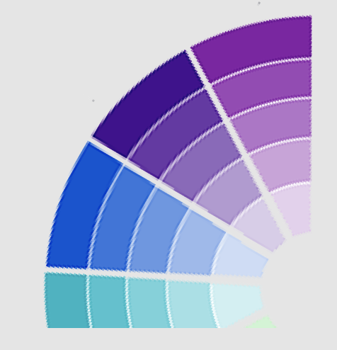

## 02/11/2020 - 08/11/2020 - The Improved Prototype
After we finished the first prototype of the UI, we obtained some suggestions from our clients.  
The first version of the UI did have some problems, for example, the whole interface is a bit messy,  
some icons and functions do not match (it is quite challenging for users to  understand the function of buttons through icons),  
and too few colour options. So we redesigned our UI with these suggestions and added a few new meritorious functions.  
[You can view it here](https://www.figma.com/proto/quo6iAuwTDs2te9PNm6VeN/Holorepository-prototype-1?node-id=95%3A29&scaling=scale-down)   
  
*Figure1: The new Viewer page*   
Figure 1 shows our new design of UI. In this version, we reserved more space for the 3D model.  
Additionally, we integrated some functions into the left side of the screen, so that the whole surface looks simpler.  
We’ve also added some new features. For instance, the first button in the upper left corner of the screen is a full-screen button.   
After the user clicks this button, all other buttons can be hidden, so that the picture is focused on the 3D model itself.  
The second button is the “withdraw” button, which the user can click to undo the previous action. The third button is used to export the edited model file.  
  
*Figure2: The colour palette*   
The palette has also been redesigned (see Figure 2). The user can rotate the artboard to get additional colors.  
This design is not only more beautiful, but also gives users more choices.  
The background can be changed as well. We currently offer three backgrounds: white, grey, and black.  
The background shown in Figure 1 is the grey one. It is worth mentioning that all the backgrounds are not solid colours, which will make UI look better.
